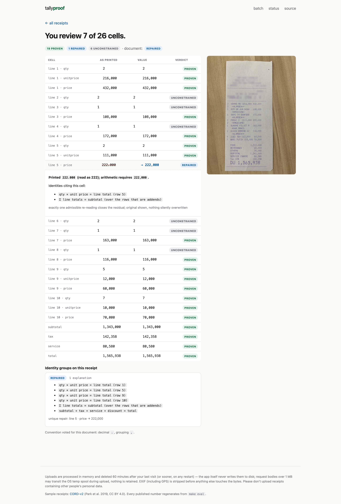

# Tallyproof

**Photograph a receipt. Every number comes back PROVEN, REPAIRED, AMBIGUOUS,
or honestly flagged — decided by exhaustive arithmetic, not confidence scores.**

🔗 **Live demo:** _URL goes here after `railway up` — see [DEPLOY.md](DEPLOY.md)_ · zero setup, no key, no signup

---

## The number that matters first

> **False repairs: 0 / 266** under seeded in-model corruption
> (exact one-sided 95% bound: < 1.2% — never claimed as a flat zero).
> Out-of-model corruption (faults the reading model deliberately excludes):
> 96.6% flagged, **3 / 232 false repairs** (1.3%; exact 95% bound < 3.4%) —
> published, not hidden.

A repair that satisfies every identity but isn't what the receipt said is
the one outcome that destroys trust in a tool like this. It is the metric
that makes the author look worst, which is why it goes first. Everything
regenerates from `make eval`; CI fails if these numbers and the code drift
apart.

## The problem

OCR tools hand you a table that *looks* right. About one numeric cell in
twenty-five is silently wrong — a dropped thousands separator, an `8` read
for a `3`, a decimal eaten by thermal fade — and `confidence: 0.94` tells
you nothing about *which*. So people re-key everything, and the tool saved
them nothing.

Tallyproof's answer: a receipt is not just text — it carries its own
arithmetic. Five identity families interlock:

```
L1   qty × unit price = line total          (per row)
L2   Σ line totals    = subtotal             (over the rows that are ADDENDS — membership unknown!)
L3   subtotal + tax + service + discount = total
L4   cash − total     = change               (independent of every line item)
L5   Σ qty            = printed item count   (constrains cells money can't reach)
```

When they all hold under the observed reading with exactly one row-grouping,
the numbers are **PROVEN** (zero-fault readings take lexicographic precedence
— see the note semantics in [solver.py](src/tallyproof/core/solver.py)).
When they don't hold, the interesting problem starts.

## The hard part: residual attribution

A broken checksum tells you *that* something is wrong, not *what*. A misread
cell, a missed row, and a receipt that genuinely doesn't add up are
**arithmetically indistinguishable**. Every tool in this space either shrugs
at the distinction or silently guesses.

Tallyproof decides it by **enumeration, not scoring**. Receipts are small
(median 2 line rows, max 11 in the evaluation corpus — measured), so the
full hypothesis space — every grouping convention × every single-glyph OCR
confusion × every subset of rows that could compose the subtotal — is under
10⁶ exact-`Fraction` evaluations. The search is *complete* within the
[declared reading model](docs/reading_model.md), and the verdict is the
**cardinality of the explanation set**:

| explanations found | verdict |
|---|---|
| exactly 1, equal to what was read | **TIES_OUT** — cells PROVEN |
| exactly 1, differing in one cell | **REPAIRED** — original shown, never silently overwritten |
| 2 or more | **AMBIGUOUS** — all of them shown; refusing to choose is the answer |
| 0 | **UNEXPLAINED** — *the paper itself doesn't add up, and that's proven* |

There is no threshold, no calibration, no `0.94` anywhere in the system.

Two subtleties most builds would skip:

- **Membership is enumerated, not assumed.** Receipts print rows that are
  not addends (voids, modifiers, section repeats). 5.1% of real receipts
  have *more than one* row-grouping that balances (measured, exhaustive) —
  certifying against an unproven grouping would be confident wrongness, so
  a **unique** closing subset is a precondition of PROVEN.
- **Cross-equation evidence breaks ties.** `subtotal 26,000` vs lines
  `10,000 + 15,000` admits two single-glyph stories (subtotal 6→5, or a
  line 5→6). The totals block settles it — only one repair satisfies
  *both* identities. This pair of scenarios is an executable test
  ([tests/test_solver.py](tests/test_solver.py)).

## Try it in 60 seconds

**Deployed:** open the URL, tap a sample tile (each shows a different honest
verdict, including a real annotation error the solver caught in CORD's
published ground truth), or photograph your own receipt.

**Local** (the only prerequisite is Python ≥ 3.11 on your PATH as `python3`):

```bash
make setup                  # venv + pip install (network, once)
make test                   # 58 tests in seconds — no key, no Docker, fully offline
make run                    # http://localhost:8123 — gallery works fully without a key
```

Live uploads additionally need a model key in the environment —
`ANTHROPIC_API_KEY=sk-ant-... make run` — the vision model transcribes;
it never verifies (see below). Without a key the app runs in clearly
labelled gallery-only mode, which carries the entire experience.

Prefer Docker? `docker build -t tallyproof . && docker run -p 8080:8080 tallyproof`
— same app, no venv.

## Screenshots

The full visual walkthrough — every page, every verdict, including the
designed degraded mode — lives in **[docs/screenshots](docs/screenshots/README.md)**
(regenerate with `scripts/make_screenshots.py`). The aha moment:



## The evidence (all third-party ground truth)

Measured on 200 real photographed receipts with human annotations by NAVER
Clova (CORD-v2, CC BY 4.0) — **no model, no image, and none of our own data
in the headline loop**. Full tables: [eval/report.md](eval/report.md).

| finding | measured |
|---|---|
| money tokens admitting ≥2 readings (`60.000`: sixty thousand or sixty?) | **83.5%** of 1,312 |
| human annotations satisfying `Σ lines = subtotal` | **84.2%** — a naive checker is wrong 1 in 6 |
| unique explanation exists (certify) | **82.2%** |
| multiple explanations (refuse) | **7.6%** |
| no explanation — receipt provably doesn't tie out | **10.2%** |
| receipts with >1 balancing row-grouping | **5.1%** |
| balancing receipts admitting an alternative balancing re-reading | **0 / 97** (exact 95% bound: < 3.1%) |

The 84.2% base rate is the number that could have killed the thesis — if
"violation" meant "extraction error", the tool would cry wolf weekly. It is
exactly why *attribution* is the product: the 15.8% is split, exhaustively,
into misreads, missed rows, and paper that is genuinely wrong.

## Anti-circularity, enforced by the import graph

Verdicts are produced **only** by `tallyproof.core`: pure Python, zero
dependencies, no network, no model client, no image access. The extractor's
output is data the solver consumes — a model (or a prompt injection printed
on a receipt) has no verb for "verified". This is a tested property
([tests/test_purity.py](tests/test_purity.py)), not a promise. The same
boundary is why every published number could be computed from third-party
annotations with no model in the loop.

**Prior art, conceded first:** arithmetic validation of documents is not
new — EN 16931 e-invoicing ships sum rules at fatal severity, and column-sum
checks appear in commercial parsers. What this build claims is narrower and,
as far as we could find, unshipped: *exhaustive attribution* of a broken
residual to cell / row / paper with the uniqueness precondition, and the
false-repair rate published as the headline.

## Repo map

```
src/tallyproof/core/       the differentiator — pure, zero-dep, no I/O
  numerals.py                the declared reading model (V(s), conventions, confusions)
  ledger.py                  the frozen contract both extractors implement
  constraints.py             L1..L5 construction + document convention vote
  solver.py                  exhaustive lattice, per-component verdicts, certificates
src/tallyproof/extract/    producers of the contract
  cord_gt.py                 CORD-v2 human annotations (powers every published number)
  vlm.py                     vision model, transcription only, retries + deadlines
src/tallyproof/app/        FastAPI + Jinja2, zero build step, no JS framework
eval/run.py                regenerates every published table (offline)
tests/                     the suite — see the table below
scripts/                   golden + sample regeneration
docs/reading_model.md      what "complete" means, precisely
decisions.md               the calls made and the alternatives rejected
```

## Tests that catch real regressions

| test | the regression it catches |
|---|---|
| `test_lattice_complete` | a pruning bug silently dropping a competing hypothesis — turning AMBIGUOUS into a false REPAIRED (Hypothesis, vs naive brute force) |
| `test_differential` | fast-path vs an independently-written reference solver over all 200 receipts |
| `prop_solver::soundness` | a change that starts "repairing" correct documents |
| `prop_solver::unique_segmentation` | PROVEN emitted while two row-groupings balance |
| `prop_numerals::round_trip` | `parse ∘ render ≠ id` — silently breaks the repair channel (NBSP/NNBSP groupers covered by hand cases in `test_numerals`) |
| `test_faults` | any false repair under seeded corruption, ever |
| `test_golden` | ANY verdict change on the 200-receipt corpus becomes a reviewable diff |
| `test_eval_frozen` | code drifting away from the published numbers |
| `test_purity` | someone wiring a model, the network, or an extractor into the verdict path |
| `test_app` | 429s without Retry-After, 500s instead of honest failure pages, upload hardening |

`make test`: all of it, **under 10 seconds, fully offline**. CI additionally
regenerates every published artifact and fails on drift.

## Deploying

One Docker container, one always-on instance — [DEPLOY.md](DEPLOY.md) has the
three Railway commands (and the generic `docker run` for anywhere else).

## The deployed demo's failure modes are designed, not discovered

- **No key / budget spent** → labelled degraded banner; the gallery works
  forever (it is precomputed and never touched a model).
- **Rate limit** (12 uploads/hour/IP, burst 5) → 429 with `Retry-After`.
- **Not a receipt** → honest 422; the system refuses to hallucinate a ledger.
- **Provider 429/5xx/timeout** → bounded jittered retries honouring
  `Retry-After`, then an honest 502. Never a naked 500.
- **Privacy**: uploads processed in memory and deleted 60 minutes after the
  last visit (sooner on restart); the app writes nothing to disk (bodies over
  1 MB may transit the OS temp spool during upload — nothing is retained);
  EXIF including GPS stripped first; no accounts, no analytics, no logging of
  document content.

## Scope, honestly

Single-page photographed retail receipts. Not bank statements, not invoices,
not handwriting, not PDFs, not the South Asian 2-2-3 digit grouping — each
exclusion is a deliberate call with reasoning in [decisions.md](decisions.md).
On the evaluation corpus about 40% of cells end up outside PROVEN —
measured: 20% UNCONSTRAINED (no identity reaches them) and 20% UNVERIFIED
(their identity group fails or their glyphs admit no reading) — and each is
labelled as exactly what it is instead of being decorated with fake confidence.

## License

MIT. Bundled evaluation data and sample images are CORD-v2 (NAVER Clova),
CC BY 4.0 — see [LICENSE](LICENSE) for attribution details.
