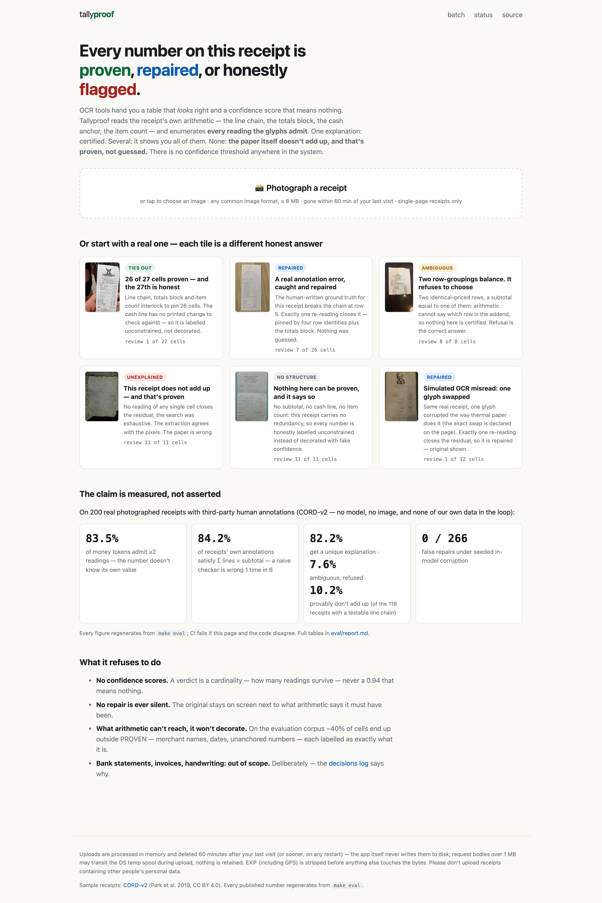
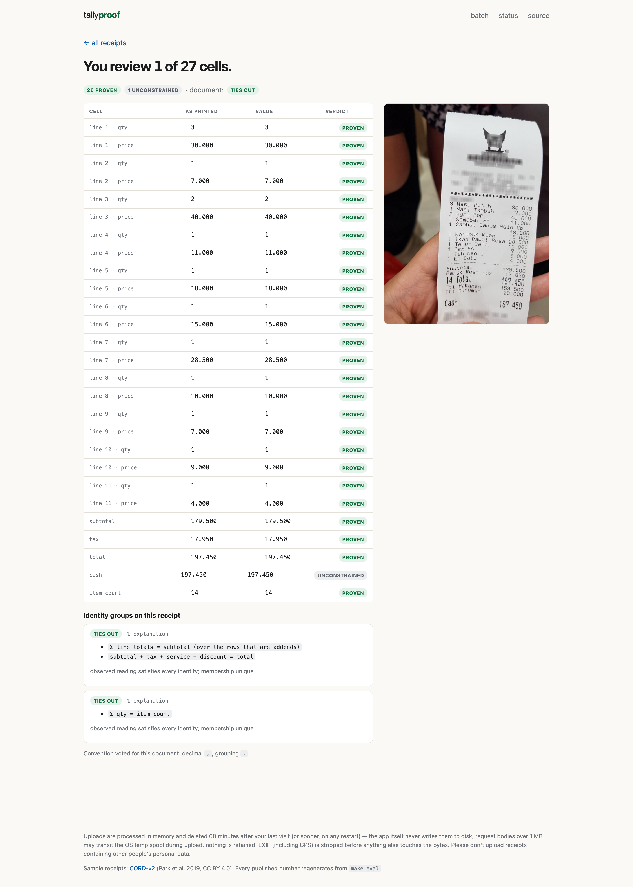
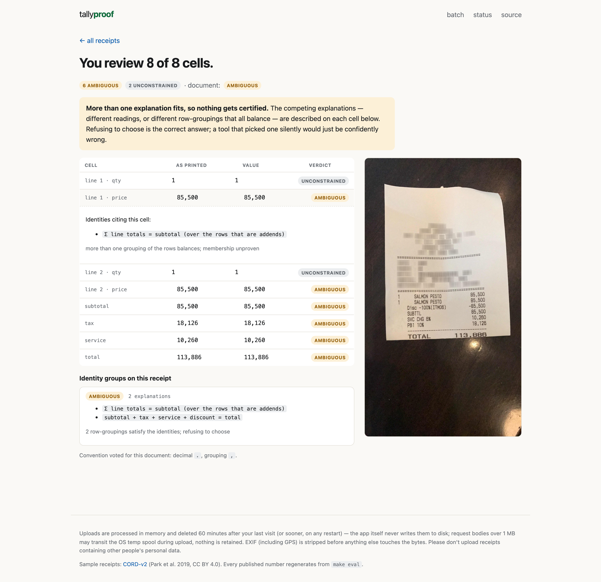
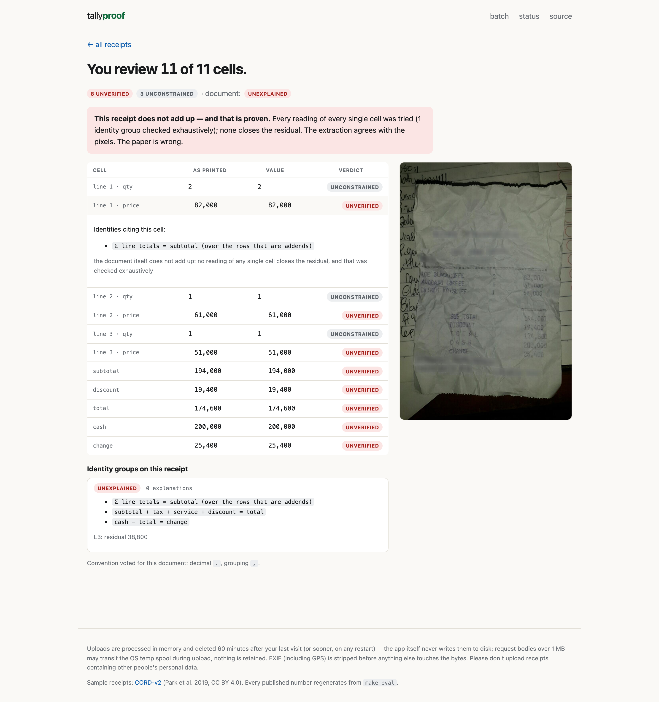
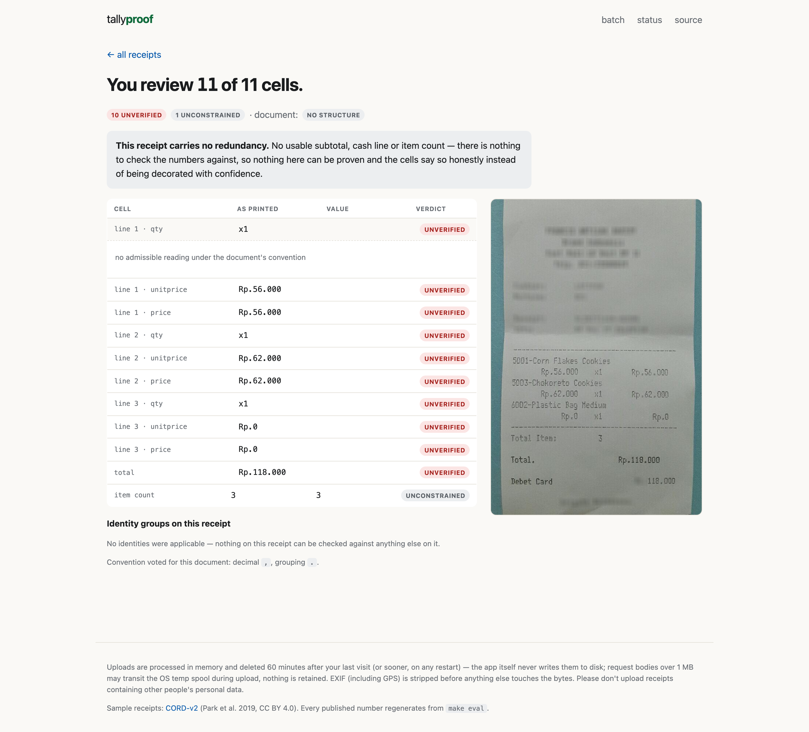
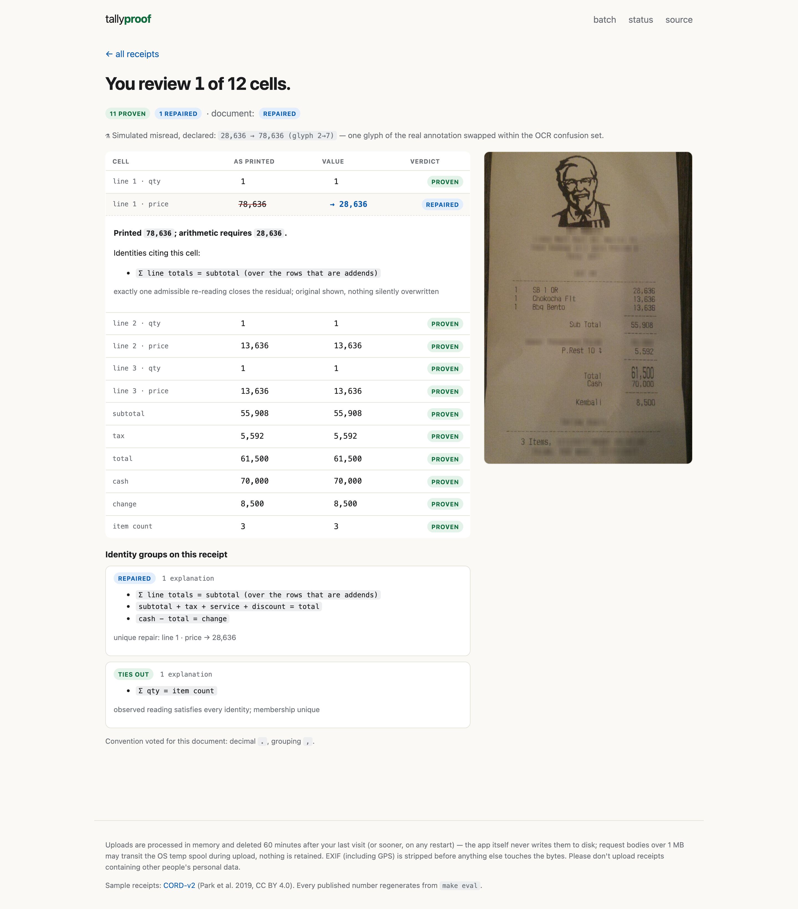
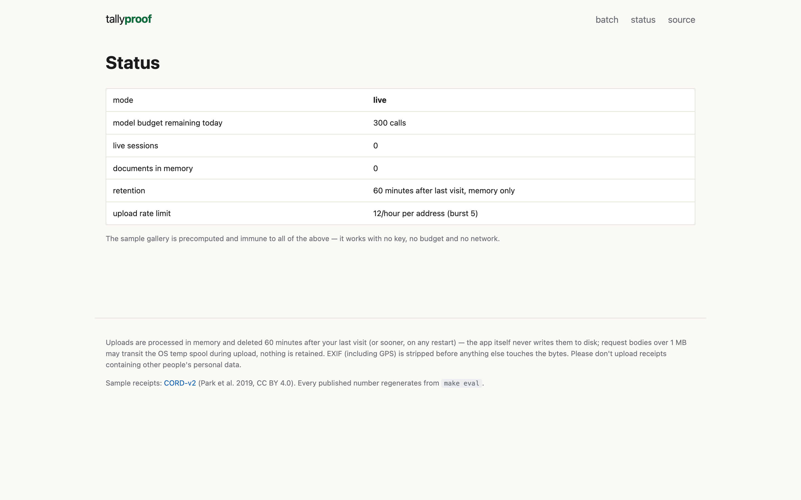
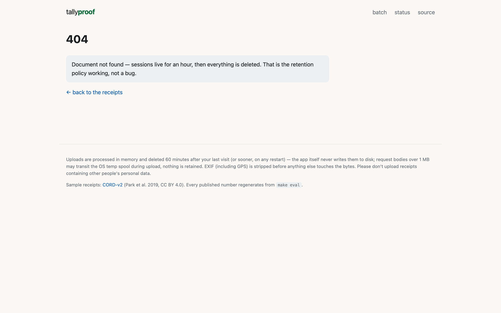
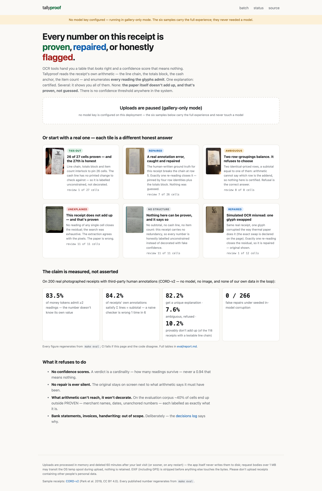

# Tallyproof — visual walkthrough

Every page of the running app, captured full-height by
`scripts/make_screenshots.py` against a local instance. The first nine
are the app as deployed with a model key; the last shows the designed
degradation when no key is configured. Nothing here is a mockup.

## landing

The landing page: the claim, the camera, six sample tiles (one per honest verdict), and the measured evidence — every number regenerates from `make eval`.

## proven

TIES_OUT: 26 of 27 cells proven by interlocking identities. The 27th — a cash line with no printed change to check against — is honestly UNCONSTRAINED.

## repaired

The aha: a real annotation error in CORD's published ground truth. `222.000` is struck through, repaired to `222,000`, and the proof panel is open — the identities that pinned it, and the statement that exactly one re-reading closes the residual.

## ambiguous

AMBIGUOUS: two row-groupings balance, so nothing is certified. Refusing to choose is the correct answer — the callout says why.

## unexplained

UNEXPLAINED: every reading of every cell was tried; none closes the residual. The extraction agrees with the pixels. The paper itself is wrong — proven, not guessed.

## no structure

NO_STRUCTURE: a receipt with no redundancy. Nothing can be proven, and every cell says so instead of wearing a fake confidence score.

## misread

Simulated OCR misread, declared on the page (one glyph swapped within the confusion set). Exactly one re-reading closes the residual, so it is repaired — original shown, never silently overwritten.

## status

The status page: mode, budget, sessions, retention — the operational truth a visitor can check.

## retention 404

The 404 for an expired document owns the retention policy: sessions live for an hour, then everything is deleted. That is the design working, not a bug.

## gallery only mode

The same landing page with no model key: uploads are honestly paused, the banner says why, and the six samples still carry the full experience — designed degradation, not a dead end.

